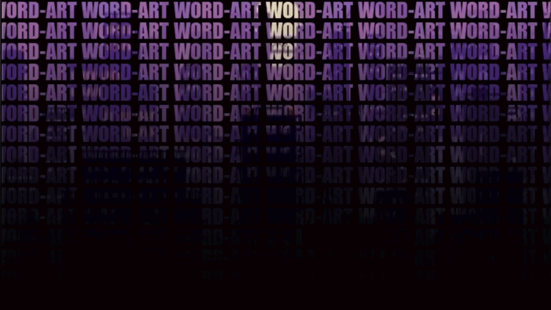

<div align="center">
  


# WORD-ART


</div>

### Word art is a program made to show images using provided text and image files.
---
<details>
<summary><strong>Table of Contents</strong></summary>

1. [Features](#features)
2. [How to Install](#how-to-install)
    - [Pip Method](#pip-method-recommended)
    - [Local install](#local-install)
3. [Usage](#usage)
    - [Supported Arguments](#supported-arguments)
    - [Examples](#examples)
5. [Contributing](#contributing)
6. [License](#license)
7. [Contact](#contact)
</u>
</details>

---

# Features
- Real-time image rendering and loading
- Support for PNG, JPG, BMP, GIF and more formats
- Customizable text overlays
- Smooth animations with pygame
- Simple pip installation

# How to install
To install it, you can mainly use 2 ways, which are listed below.

The recommended method is via pip, which handles all dependencies automatically. Alternatively, if you prefer to work with the source code or contribute to the project, you can clone the repository and install it locally.

Choose the method that best fits your needs:

## Pip method (Recommended)

```bash
pip install word-art
```

## Local install

```bash
git clone https://github.com/seu-username/word-art.git
cd word-art
pip install -e .
```
This method is useful if you want to modify the code or contribute to the project.

## Usage

### Basic usage

Run the program with default settings (uses included Miku image and "MIKU" text):

```bash
word-art
```

### With custom image

```bash
word-art -i path/to/your/image
```

### With custom text

```bash
word-art -t "YOUR TEXT HERE"
```

### With both image and text

```bash
word-art -i path/to/image -t "YOUR TEXT HERE"
```

### View help

```bash
word-art --help
```
## Supported Arguments

| Argument | Short | Description | Default |
|----------|-------|-------------|---------|
| `--image` | `-i` | Path to image file | `./miku.png` |
| `--text` | `-t` | Text to overlay | `MIKU` |

## Examples

Default (Used for debugging and testing)
```bash
word-art # Uses default miku image and text
```
Using only custom image (Used if you want to keep the default "MIKU" text)
```bash
word-art -i "C:\Users\your_user\Downloads\dog.png" 
# Displays the provided dog image using the default "MIKU" text
```
Using both customized image and text
```bash
word-art -i "C:\Users\your_user\Downloads\dog.png" -t "DOG"
# Displays the provided dog image using the text "DOG"
```

## Contributing

We welcome contributions! If you'd like to help improve this project, here's how:

### How to Contribute

1. Fork the repository
2. Create your feature branch (`git checkout -b feature/AmazingFeature`)
3. Commit your changes (`git commit -m 'Add some AmazingFeature'`)
4. Push to the branch (`git push origin feature/AmazingFeature`)
5. Open a Pull Request

### Guidelines

- Keep code clean and readable
- Test your changes before submitting
- Follow Python conventions (PEP 8)
- Write clear commit messages
- Update the README if needed

### Reporting Bugs

Found a bug? Please open an issue with:
- Description of the bug
- Steps to reproduce
- Expected behavior
- Your environment (Python version, OS, etc)

### Suggesting Features

Have an idea? Open an issue with:
- Clear description of the feature
- Why it would be useful
- Possible implementation approach

## License

This project is licensed under the MIT License - see the [LICENSE](LICENSE) file for details.

## Contact

[](mailto:caio_luiz_hermann@hotmail.com)[](https://github.com/CaioLuizHermann)

---

**⭐ If you found this project useful, please give it a star!**